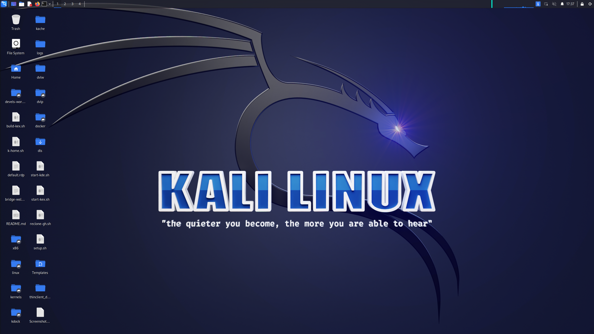

# Idle Hands are the **Developer's Workshop**

## Import a Linux Docker image from the [Docker Hub](https://hub.docker.com/search?q=&image_filter=official) into WSL _virtually_ without lifting a finger

---

---

## SETUP

### Easy as 1, 2, .., 4

```bat
powershell.exe -Command "Invoke-WebRequest https://raw.githubusercontent.com/kindtek/powerhell/dvl-works/devel-spawn.ps1 -OutFile $env:USERPROFILE/dvlp.ps1;powershell.exe -ExecutionPolicy RemoteSigned -File $env:USERPROFILE/dvlp.ps1 kali-cli"


```

1. copypasta the above line of code into a terminal ([CMD or Powershell](https://www.wikihow.com/Open-Terminal-in-Windows))
2. follow instructions and log in to your machine between restarts
3. ??
4. profit

---

## With little more than a few key strokes and restarts, a suite of interconnected developer productivity software will be pushed to your Windows 10+ machine. The list of new capabilites added to your toolbox in this automated process is practically endless. Easily rename/backup/restore your WSL distributions, hit the ground coding in WSL with VSCode, configure the latest bleeding edge builds of Linux kernels for your system, etc, etc. You can even even put on your white hat and help Ukraine bring Russia's war to an end with [Kali Linux OS](https://www.kali.org/docs/wsl/win-kex/). Okay, perhaps achieving world peace is overselling it... but with the devels-workshop you never know what the devel may do. Should you choose to do so, uninstalling everything introduced to your system by the devel's workshop is effortless as well

# BONUS: if you have ever had problems with Windows Docker Desktop crashing (and/or WSL) you are in the right place. Included in the devels workshop is an automatic troubleshooting tool to keep you online without worrying about your productivity coming to an abrupt halt




### Installation is so smooth that you will likely feel like you skipped a step -- especially if you have tangled with any of the several automated procedures included _(ie : setting up your system with automated builds for your Github/Docker repository, installing WSL with systemd or Docker-in-Docker, issuing keys for SSH logins, manually adding new app registries, building a Linux kernel from scratch, installing a Linux GUI on WSL, etc, etc)_. But don't worry, as long as you keep repeating step 2, have a reliable internet connection, and a handful of spare gigabytes on your machine, you are good to go - there is no technical expertise required. You can use some of the time you're saving (and waiting for the install to complete) to make an informed choice on what shiny new toy you want to play with first. You can either try out your freshly installed WSL distribution and use Kali Linux to go straight to `/hel` in a ~~hand..~~ [sandboxed user environment](https://github.com/kindtek/devels-playground#line-dance-with-the-devel) or use the devel's playground to try out any of the thousands of Docker Linux images on the [Docker Hub](https://hub.docker.com/search?q=&image_filter=official) integrated seamlessly with your machine. Check out the summary of user environments images offered by Kindtek [here](https://github.com/kindtek/devels-playground#image-tags)

## At the end of the installation sequence, your WSL environment will be pushed a ~250MB [image](https://github.com/kindtek/devels-playground#kali-dind) image and the capability to contribute to this repository using either Github or Docker immediately. Depending on your machine and image choice this will roughly take an hour - or more especially if you choose an image with a kernel - and will save you 10+ times that amount of time even for an experienced developer. If you're a project leader with a medium to large team this is a very helpful time saver and you should consider [forking this repository](https://github.com/kindtek/devels-workshop/fork) or contacting Kindtek for help setting this up according to your needs

---

### The Docker Linux images created by Kindtek and hosted by Docker on the [Docker Hub](https://hub.docker.com/search?q=&image_filter=official) are available for free [here](https://github.com/kindtek/devels-playground#image-tags)

### Got an idea, suggestion, need help, want to contrinbute, become an beta tester, or find a bug? Feel free to create an [issue](https://github.com/kindtek/devels-workshop/issues) or [pull request](https://github.com/kindtek/devels-workshop/pulls)

### Note 1: This project currently is in alpha status (although it is rapidly approaching beta). It is to be used only for development purposes until an official stable version is released

### Note 2: Please be patient, Mac users. The devel's workshop is currently only available for Windows. Mac integration is actually much easier to build for than Windows so Mac support will be here before you know it

---

&nbsp;

## All in a day's work

## Now time for the fun stuff

## **Instructions for choosing an image from [hub.docker.com](https://hub.docker.com/search?q=&image_filter=official) and the official [kindtek devel's playground docker hub repo](https://hub.docker.com/r/kindtek/dvlp/tags) into WSL with the devel's playground are [found here](https://github.com/kindtek/devels-playground#idle-minds-are-the-developers-playground)**

&nbsp;

## NEW FEATURES

## Build a kernel and pop into a [Kali KEX GUI](https://www.kali.org/docs/wsl/win-kex/) with [kali-gui-kernel-goodies](https://hub.docker.com/r/kindtek/devels-playground/tags)

### just copypasta this:

```bat
powershell.exe -Command "Invoke-WebRequest https://raw.githubusercontent.com/kindtek/powerhell/dvl-works/devel-spawn.ps1 -OutFile $env:USERPROFILE/dvlp.ps1;powershell.exe -ExecutionPolicy RemoteSigned -File $env:USERPROFILE/dvlp.ps1 kali-gui-kernel-goodies"


```

### [CLICK for more details](https://github.com/kindtek/devels-playground#kali-gui-goodies)

---

---

&nbsp;

MIT License

Copyright (c) 2023 KINDTEK, LLC

Permission is hereby granted, free of charge, to any person obtaining a copy
of this software and associated documentation files (the "Software"), to deal
in the Software without restriction, including without limitation the rights
to use, copy, modify, merge, publish, distribute, sublicense, and/or sell
copies of the Software, and to permit persons to whom the Software is
furnished to do so, subject to the following conditions:

The above copyright notice and this permission notice shall be included in all
copies or substantial portions of the Software.

THE SOFTWARE IS PROVIDED "AS IS", WITHOUT WARRANTY OF ANY KIND, EXPRESS OR
IMPLIED, INCLUDING BUT NOT LIMITED TO THE WARRANTIES OF MERCHANTABILITY,
FITNESS FOR A PARTICULAR PURPOSE AND NONINFRINGEMENT. IN NO EVENT SHALL THE
AUTHORS OR COPYRIGHT HOLDERS BE LIABLE FOR ANY CLAIM, DAMAGES OR OTHER
LIABILITY, WHETHER IN AN ACTION OF CONTRACT, TORT OR OTHERWISE, ARISING FROM,
OUT OF OR IN CONNECTION WITH THE SOFTWARE OR THE USE OR OTHER DEALINGS IN THE
SOFTWARE.

&nbsp;
